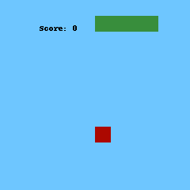

# Snake RL

The aim of this work is to develop an AI that can play Snake.


### Built With

* [Python 3.9](https://www.python.org)
* [Keras](https://keras.io/)
* [OpenCV](https://opencv.org/)
* [Scikit Learn](https://scikit-learn.org/stable/) 
* [Matplotlib](https://matplotlib.org/)



## Getting Started

After cloning the repo you have to run:

```
conda env create -f environment.yml
conda activate snake
```

## Usage


### Training and Testing

Check ***Snake_Python.ipynb*** for usage.

### Visualization 

Check ***window.py*** for usage.

## Results 

After 100.000 episodes of training, on 200 episodes of testing, I had the following results:

```
Average score: 12.15 
Variance: 50.27 
Max Value: 27
```

